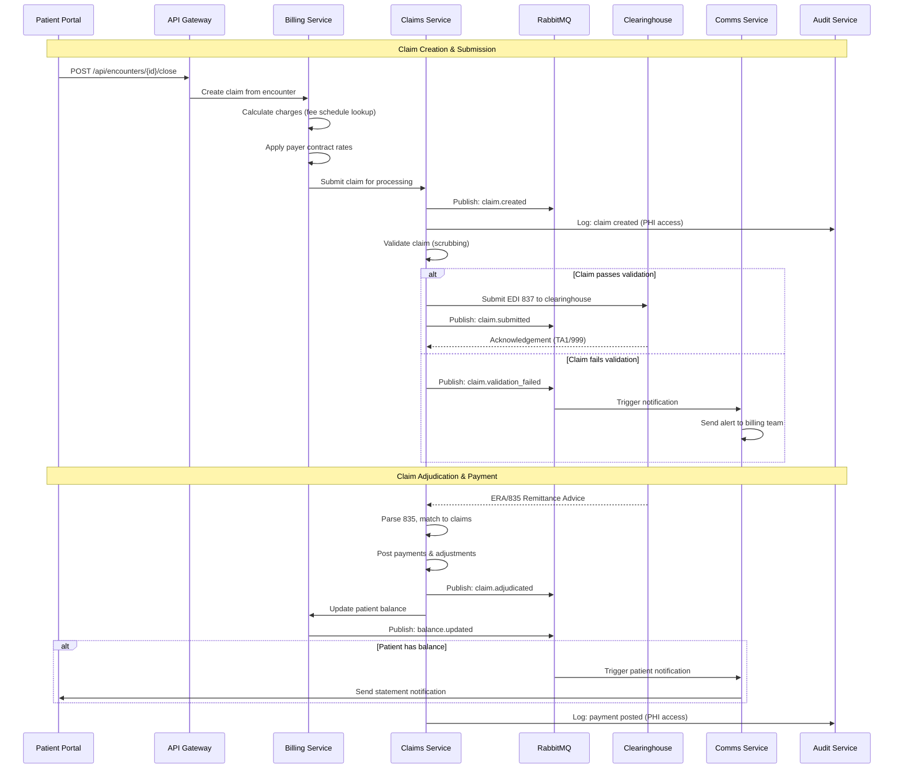
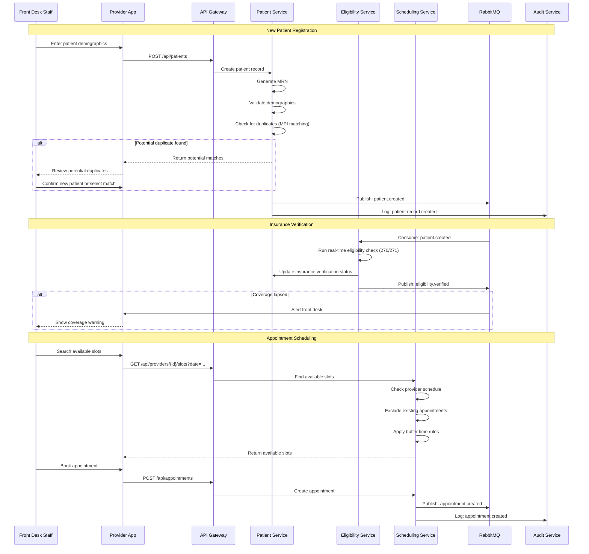
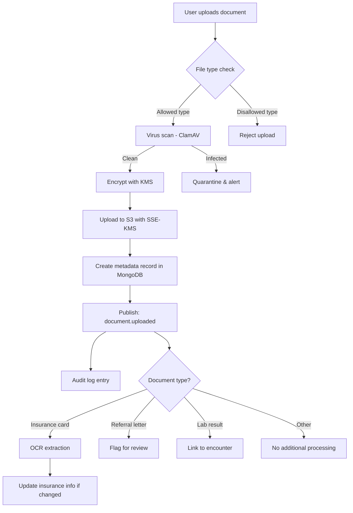
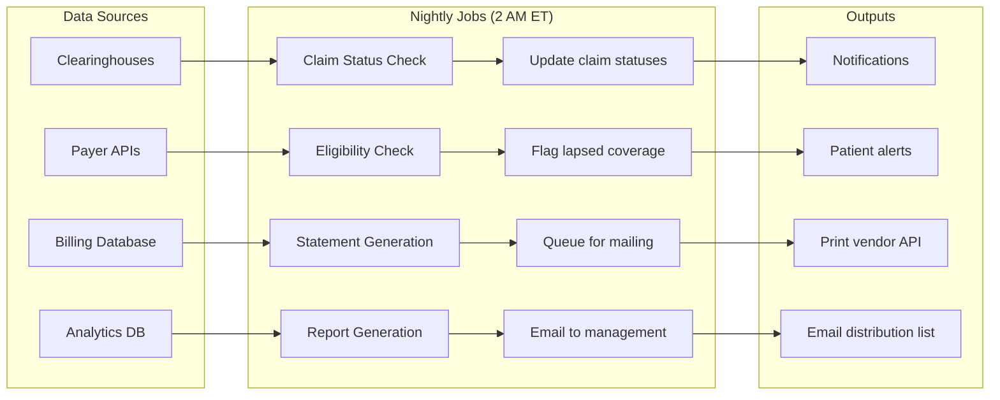

# Data Flow Diagrams

> **Last updated:** 2024-10
> **Owner:** Platform Team

## Claim Processing Flow

This is the primary data flow for processing healthcare claims from creation to payment posting.

## Patient Management Flow

## Document Upload Flow

## Nightly Batch Processing

## Event Bus Topology

Key RabbitMQ exchanges and queues:

| Exchange | Type | Routing Key Pattern | Consumers |
|----------|------|-------------------|-----------|
| `meridian.events` | topic | `patient.*` | patient-service, analytics-service, audit-service |
| `meridian.events` | topic | `appointment.*` | scheduling-service, comms-service, audit-service |
| `meridian.events` | topic | `claim.*` | claims-service, billing-service, analytics-service, audit-service |
| `meridian.events` | topic | `document.*` | documents-service, audit-service |
| `meridian.events` | topic | `eligibility.*` | eligibility-service, patient-service |
| `meridian.notifications` | direct | `email` | comms-service |
| `meridian.notifications` | direct | `sms` | comms-service |
| `meridian.notifications` | direct | `push` | comms-service |
| `meridian.dlx` | fanout | - | Dead letter queue consumer (alerting) |

## Data Retention

| Data Type | Hot Storage | Warm Storage | Cold Storage | Total Retention |
|-----------|-------------|--------------|--------------|-----------------|
| Patient records | Indefinite | - | - | Indefinite |
| Claims | 2 years | 5 years | 7 years | 7 years (regulatory) |
| Audit logs | 1 year | 5 years | 6 years | 6 years (HIPAA) |
| Documents | 2 years | 5 years | S3 Glacier | 10 years |
| Analytics | 1 year | - | - | 1 year (aggregated forever) |
| Session data | 30 minutes | - | - | 30 minutes |
